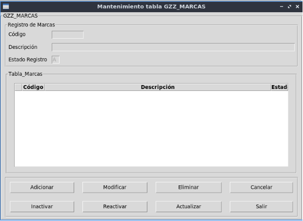
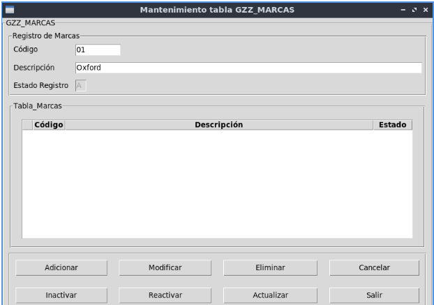

# GRUPO 17 LABORATORIO BASE DE DATOS (rama main)
## INTEGRANTES 
- Alvarez Astete Kevin Jheeremy
- Calcina Puma Esteven Antonio
- Galvez Quilla Henry Isaias

## REQUERIMIENTOS PARA EJECUTAR EL PROGRAMA EN MYSQL
- Python 3.8.10
- Libreria tkinter
- Libreria Mysql
- SGBD Mysql

## Instrucciones para probar los triggers,vistas y procedimientos almacenados
- En Mysql ejecutar el archivo scriptBase.sql, el cual creara el modelo
- Para poblar la base de datos, usar el archivo llenarBDLimpio.sql, el cual llenara todas las tablas(excepto Estado de Registro, que ya esta llenado)
- Para las vistas, triggers y procedimientos almacenados usar funciones.sql. (Borrar comentarios del archivo)

## REQUERIMIENTOS PARA EJECUTAR EL PROGRAMA EN ORACLE
- Python 3.8.10
- Libreria tkinter
- Libreria Cx_oracle
- SGBD Oracle

## Instrucciones para probar los triggers,vistas y procedimientos almacenados en Oracle
- En Oracle ejecutar el archivo scriptBase.sql, el cual creara el modelo
- Para poblar la base de datos, usar el archivo llenarBDLimpio.sql, el cual llenara todas las tablas(excepto Estado de Registro, que ya esta llenado)
- Para las vistas, triggers y procedimientos almacenados usar funciones.sql
